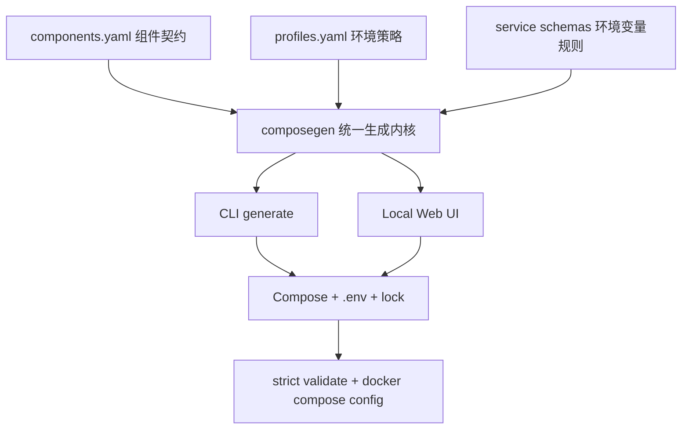

# 00 · 升级总览：现状基线、问题清单、原则与目标架构

> 本文是 Stargate Suite 升级的事实基线与设计总览。逐 PR 工作包见同目录 `pr-01` … `pr-14`。
> 所有现状数据均基于对真实仓库的核对（2026-08-27）。

## 1. 当前版本基线

| 项目 | Suite 权威源默认值 | 已生成 `build/*` 实际值（已漂移） | 当前稳定版本（只读契约） |
|---|---|---|---|
| Stargate | `v0.11.0` | `v0.9.2` | `v1.0.0` |
| Warden | `v0.13.0` | `v0.10.0` | `v1.1.0` |
| Herald | `v0.9.0` | `v0.6.1` | `v1.1.0` |
| Stargate Suite | `v0.9.2` | — | 待升级 |

**权威源**：`config/env-meta.yaml`（`HERALD_IMAGE/WARDEN_IMAGE/STARGATE_IMAGE` 默认值）、`.env.example`、`compose/canonical/docker-compose.yml`。这三处一致为 Stargate `v0.11.0` / Warden `v0.13.0` / Herald `v0.9.0`——与源计划声称的「Suite 当前默认」一致。

**关键偏差（本轮核对新发现）**：`build/` 下已生成的 compose 输出严重滞后于权威源：

- `build/image/docker-compose.yml`、`build/traefik/docker-compose.yml`：Stargate `v0.9.2`、Warden `v0.10.0`、Herald `v0.6.1`。
- `build/traefik/docker-compose.yml` 的 `herald-dingtalk` 指向 `:latest`（权威源为 `v0.5.0`）。
- `build/traefik-stargate`、`build/traefik-warden`、`build/traefik-herald` 同样是旧版本。

> 结论：这些 `build/*` 是过期生成物（generated artifacts），不应作为版本事实。它们与权威源的偏离正是问题 **M-01** 的直接证据：同一「版本事实」散落在权威源与生成物两套体系，无单一来源约束。修复方向见 [pr-04](pr-04-component-manifest.md)（组件清单）与 [pr-08](pr-08-upgrade-core-images-and-hmac-v2.md)（原子升级）。

参考稳定版本：
- [Stargate v1.0.0](https://github.com/soulteary/stargate/releases/tag/v1.0.0)
- [Warden v1.1.0](https://github.com/soulteary/warden/releases/tag/v1.1.0)
- [Herald v1.1.0](https://github.com/soulteary/herald/releases/tag/v1.1.0)

## 2. P0/P1 问题清单

| 编号 | 优先级 | 问题 | 影响 | 真实证据（本仓库） |
|---|---|---|---|---|
| B-01 | P0 | `go.mod` 为 Go 1.27，CI/Dockerfile 为 Go 1.25 | 所有测试和构建在依赖下载前失败 | `go.mod` `go 1.27.0`；`Dockerfile` `FROM golang:1.25-alpine3.22`；`ci.yml` 三处 `1.25` |
| B-02 | P0 | 发布镜像只复制二进制，`serve` 运行时依赖的 `config/`、`compose/` 未进镜像 | 镜像默认入口无法独立提供配置生成服务 | `Dockerfile` 仅 `COPY --from=builder /app/stargate-suite`，未包含 `config/`、`compose/` |
| C-01 | P0 | 直接升级默认镜像到 v1 会同时破坏端口、健康检查和 HMAC E2E | 无法通过一次简单版本替换完成升级 | `compose/canonical` Stargate 端口 80、`/health`；Herald E2E 使用旧签名 |
| S-01 | P0 | Redis 客户端密码与服务端 `requirepass` 未联动 | 配置密码后可能无法连接；不配置时 Redis 无认证 | canonical 中 `herald-redis`/`warden-redis` 无 `--requirepass`，客户端 `REDIS_PASSWORD` 可留空 |
| S-02 | P1 | production 仍可能继承固定 API Key、短 HMAC secret、`plaintext` 密码 | 生成结果可能被误用于正式环境 | canonical `API_KEY=test-herald-api-key`、`HMAC_SECRET=test-hmac-secret`、`PASSWORDS=plaintext:test1234\|test1337` |
| S-03 | P1 | `exposePorts` 默认开启，Herald/Warden/Redis 等可暴露到宿主机 | 扩大访问面并造成端口冲突 | `config/ports.yaml` 全部服务 `showWhenOption: exposePorts`；canonical 中 herald `8082:8082`、herald-redis `6379:6379` |
| A-01 | P1 | Herald E2E 使用旧 HMAC 规范，缺少 method/path/nonce/body hash/key ID 绑定 | 测试通过不能证明当前 Herald 安全契约正确 | `e2e/herald_api_test.go`、`e2e/test_helpers.go` 中的手工签名 |
| A-02 | P1 | 未显式配置 `REQUEST_AUTH_MODE`、`ENVIRONMENT` | 组件行为依赖默认值，配置意图不明确 | canonical 未出现 `ENVIRONMENT`、`REQUEST_AUTH_MODE` |
| V-01 | P1 | 配置校验主要覆盖端口和 URL，未知变量只警告 | 不能阻止不完整 TLS、弱密钥和互斥选项 | `cmd/suite/cmd_validate.go` 现有校验范围 |
| M-01 | P1 | 版本和配置定义分散在 canonical Compose、env-meta、services、README、`.env.example` 与 `build/*` | 后续仍会持续漂移（见第 1 节偏差） | 权威源 vs `build/*` 版本不一致 |
| R-01 | P1 | Tag 发布对 `latest` 的判断不准确，发布元数据未真正注入二进制 | 发布结果与说明不一致 | `.github/workflows/release.yml`；`Dockerfile` 有 `VERSION/COMMIT/BUILD_DATE` ARG 但未注入 ldflags |
| R-02 | P1 | GitHub Actions 未全部固定到 Commit SHA，缺少 SBOM、签名、证明 | 供应链可复现性弱于三个核心项目 | `ci.yml`/`release.yml` 使用 `@v6` 等浮动 tag |

## 3. 应保留并强化的能力

- canonical Compose 作为生成源的设计思路（`compose/canonical/docker-compose.yml`）；
- Web UI 分步配置体验（`cmd/suite/cmd_serve.go` + `cmd/suite/static`）；
- image / build / Traefik 一体化 / Traefik 分拆等生成模式（`build/{image,build,traefik,traefik-*}`）；
- 现有 Warden fixture 与正常/错误/限流/审计/指标测试框架（`fixtures/`、`e2e/*_test.go`）；
- TOTP、DingTalk、SMTP 等可选组件的扩展位置；
- 中英文配置说明（`README.md`/`README.zh-CN.md`、`config/README*.md`、`config/i18n/`）；
- `composegen` 与 Web handler 已有单元测试基础（`internal/composegen/`）。

不推翻重写 UI，也不把三个服务实现复制进 Suite。

## 4. 改造原则

1. **先恢复基线，再升级协议**：先修复 Go 版本与容器运行问题；CI 未恢复前不做大规模契约迁移。
2. **版本升级必须原子化**：组件版本、环境变量、Compose、健康检查和 E2E 必须在同一可验证阶段切换（对应 PR 8）。
3. **一个事实只有一个来源**：版本、端口、健康路径、Profile 默认值不得在多个文件独立维护（对应 PR 4 组件清单）。
4. **生产配置默认拒绝风险，而不是提示风险**：warning 只适用于开发体验；production 的弱密钥、测试接口、明文密码、不完整 TLS 必须返回错误。
5. **测试真实协议，不复制协议猜测**：优先使用上游 SDK；若必须实现签名，必须用上游测试向量交叉验证。
6. **存活与就绪分离**：进程存活不能被 Redis/Warden/Herald 暂时不可用转换成容器重启风暴。
7. **内部服务默认不发布端口**：开发和测试需要宿主机访问时，仅绑定 `127.0.0.1`。
8. **PR 小而可回滚**：每个 PR 只解决一个清晰主题，禁止在协议迁移 PR 中混入无关格式化或前端重构。
9. **兼顾 CI 成本**：PR 快速反馈，主分支完整验证，Tag 执行发布矩阵。
10. **文档与代码同步交付**：每项用户可见变化必须在同一 PR 更新配置说明或迁移文档（中英文）。

## 5. 目标架构

### 5.1 配置生成链路



CLI 与 Web UI 只负责收集输入和展示错误，不能各自维护生成逻辑。**当前状态与此背离**：`make gen` 通过 `scripts/gen-via-api.sh` 走 Web API，CLI 无独立 generate，是 PR 10 要消除的歧义。

### 5.2 建议目录结构

```text
config/
├── components.yaml          # 组件版本、镜像、端口、健康路径、契约版本（PR 4 新增）
├── profiles.yaml            # development/test/production 默认策略（PR 5 新增）
├── schemas/                 # 环境变量类型、敏感性、约束、适用版本（逐步引入）
│   ├── stargate.yaml
│   ├── warden.yaml
│   └── herald.yaml
├── services.yaml            # UI 布局，仅引用 schema 字段（现有）
├── env-meta.yaml            # 可逐步由 schemas 生成（现有）
├── ports.yaml               # 可逐步由 components 生成（现有）
└── i18n/                    # 现有

internal/
├── contract/                # 组件清单和 schema 加载、版本契约（PR 4 新增）
├── composegen/              # 纯生成函数（现有）
├── policy/                  # Profile 与跨字段安全校验（PR 5/7 新增）
└── doctor/                  # 运行时诊断（PR 10 新增）

e2e/
├── contract/                # HMAC、API、健康检查契约
├── flows/                   # 登录、OTP、TOTP、会话流程
├── failure/                 # Redis/Herald/Warden 故障与恢复
└── fixtures/
```

迁移循序进行；不要求第一个 PR 完成全部目录调整。

### 5.3 组件清单建议（PR 4 落地）

```yaml
schemaVersion: 1

components:
  stargate:
    image: ghcr.io/soulteary/stargate
    version: 1.0.0
    contractVersion: v1
    containerPort: 8080
    livenessPath: /healthz
    readinessPath: /readyz

  warden:
    image: ghcr.io/soulteary/warden
    version: 1.1.0
    contractVersion: v1
    containerPort: 8081
    livenessPath: /healthcheck

  herald:
    image: ghcr.io/soulteary/herald
    version: 1.1.0
    contractVersion: v1
    containerPort: 8082
    livenessPath: /healthz
```

> 注意：**PR 4 阶段先登记当前旧版本**（Stargate `v0.11.0`、Warden `v0.13.0`、Herald `v0.9.0`），不立即改变运行行为；真正升到 v1 由 **PR 8** 原子完成。正式发布时另生成 `components.lock.yaml` 记录镜像 digest。

### 5.4 三类部署 Profile

| 策略 | development | test | production |
|---|---|---|---|
| 用途 | 本地体验 | CI/E2E | 实际部署模板 |
| 端口绑定 | `127.0.0.1` | `127.0.0.1` | 默认仅反向代理入口 |
| 密钥 | 自动生成或用户输入 | 隔离的确定性测试值 | 必须用户提供或引用 secret file |
| 密码算法 | 可显式允许 plaintext | 可使用测试密码 | 禁止 plaintext |
| Herald 认证 | API Key 可选 | 独立测试 API Key/HMAC v2 | HMAC v2 或 mTLS，显式模式 |
| Herald test API | 禁用或显式开启 | 独立 loopback listener | 禁止 |
| Redis | 可自动生成密码 | 隔离密码 | 密码必需，端口不发布 |
| Cookie Secure | 本地 HTTP 可关闭 | 可关闭 | 必须开启 |
| HMAC v1 | 禁止，兼容模式需显式确认 | 禁止 | 禁止 |
| 容器权限 | 最小权限 | 最小权限 | 最小权限、只读根文件系统 |
| 校验模式 | warning + error | strict | strict |

Profile 是安全和运行策略，不只是预填表单。production Profile 不得允许通过「继续生成」绕过错误。

## 6. 真实运行契约对照（迁移目标）

| 维度 | 当前（真实仓库） | v1 目标 |
|---|---|---|
| Stargate 容器端口 | `80`（canonical / `config/ports.yaml`） | `8080` |
| Stargate liveness | `/health`（canonical healthcheck、`make health`） | `/healthz` |
| Stargate readiness | 无 | `/readyz` |
| Warden liveness | `/health`（canonical healthcheck） | `/healthcheck` |
| Herald liveness | `/healthz`（canonical，已符合） | `/healthz` |
| Herald 认证模式 | 隐式（同时填 `API_KEY` 与 `HMAC_SECRET`） | 显式 `REQUEST_AUTH_MODE=hmac_v2` |
| HMAC 版本 | 旧手工签名（`e2e/`） | HMAC v2（method/path/body/timestamp/nonce/service/key ID） |
| CI E2E 探测 | `8080/health`、`8081/health`、`8082/healthz`（`ci.yml`） | 随端口/健康路径迁移同步更新 |
| `make health` | Stargate `:80/health` | Stargate `:8080/healthz` 或 `/readyz` |
